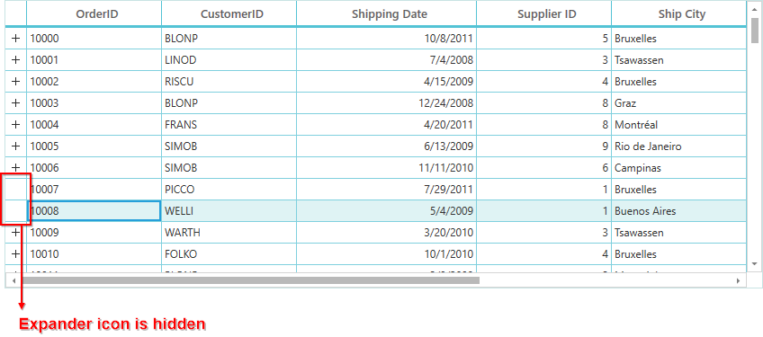
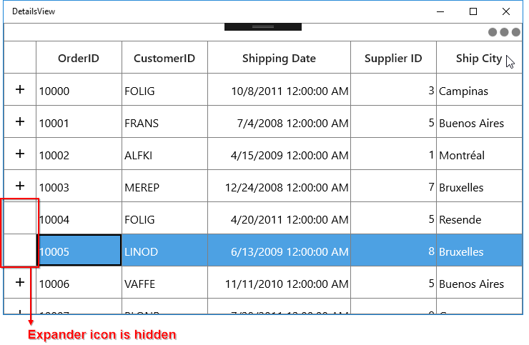

# How to Hide the DetailsView Expander Icon Based on Child Records Count in WPF / UWP DataGrid?

This example illustrates how to hide the detailsview expander icon based on child records count in [WPF DataGrid](https://www.syncfusion.com/wpf-controls/datagrid) and [UWP DataGrid](https://www.syncfusion.com/uwp-ui-controls/datagrid) (SfDataGrid).

By default, the state of expander icon is visible for all the data rows in parent DataGrid even if its **RelationalColumn** property has an empty collection or null.

You can customize hiding the details view expander icon by handling the **SfDataGrid.QueryDetailsViewExpanderState** event. This event occurs when expander icon is changed on expanding or collapsing the details view. You can hide the expander icon by setting the **ExpanderVisibility** property to `false` in the **SfDataGrid.QueryDetailsViewExpanderState** event based on condition.

``` c#
this.dataGrid.QueryDetailsViewExpanderState += DataGrid_QueryDetailsViewExpanderState;

private void DataGrid_QueryDetailsViewExpanderState(object sender, Syncfusion.UI.Xaml.Grid.QueryDetailsViewExpanderStateEventArgs e)
{
    var orderInfo = e.Record as OrderInfo;
    if (orderInfo != null)
    {
        if (orderInfo.OrderDetails.Count == 0)
        {
            e.ExpanderVisibility = false;
        }
    }
}
```

The following screenshot illustrates how to hide the state of expander icon based on child items count.

#### WPF DataGrid Image:



#### UWP DataGrid Image:


